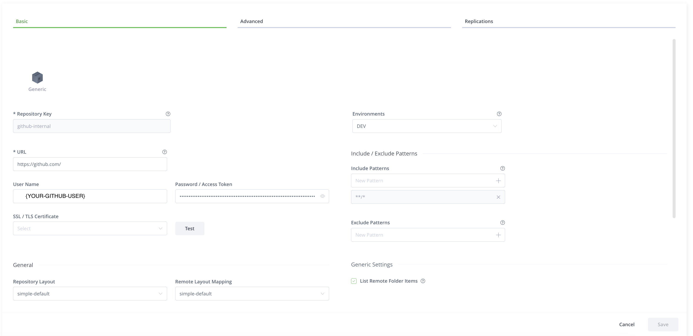
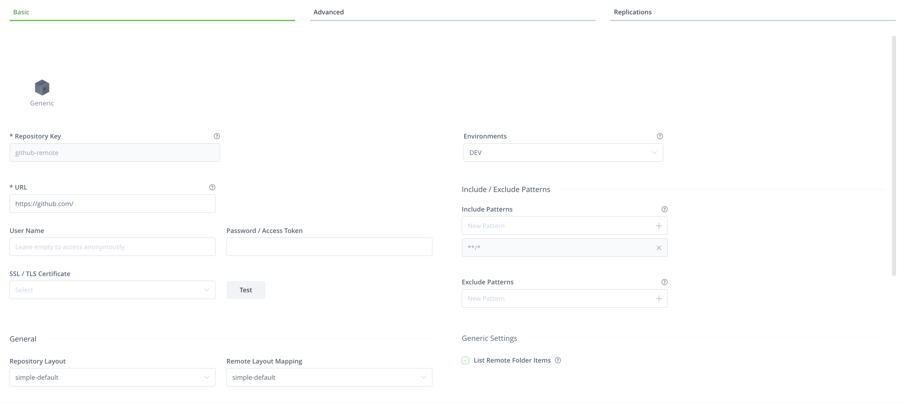
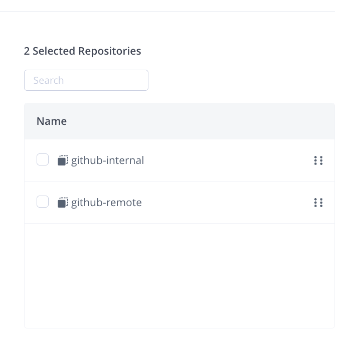

# Artifactory and Bazel

Running Bazel on our CI we started noticing a lot of intermittent failures around
Bazel downloading Go artifacts and GitHub assets. This was causing a lot of friction
with our developers due to unreliable builds.

## Artifactory

We decided to use Artifactory as we recently started a project to standup instances
and Artifactory has good out-of-the-box solutions for proxies for a company of our sized.

### Go
We were not publishing our GitHub Go artifacts directly to Artifactory and to avoid having to configure that
we created three Artifactory repos:

1. Remote Go Repository for private GitHub repos
2. Remote Go Repository for public GitHub repos
3. Virtual Go Repository for the remote repos

For 1 & 2 we followed the default set up documented in [Artifactory](https://jfrog.com/help/r/jfrog-artifactory-documentation/proxy-github-with-go),
The only addition is for the 1 is using a private account we have for CI so Artifactory can access our internal repos.

Then we added a [virtual repository](https://jfrog.com/help/r/jfrog-artifactory-documentation/set-up-virtual-go-repositories) with resolution order private remote repo then public remote repo.

#### Verify
To test this out, I made a simple go project downloading from a private repo:
```go
import _ github.com/my-company-org/my-private-repo
```
You can run Artifactory's [Set Me Up Option](https://jfrog.com/help/r/what-s-new-in-the-set-me-up-dialog/the-set-me-up-option-explained)
to generate a token for you.

Make sure your user can update the profile if not you'll have to follow this [article](https://jfrog.com/help/r/artifactory-unable-to-generate-identity-token-and-edit-profile-is-missing/issue)
Ensure you set up GONOSUMDB for your private repo as Go won't have a way to verify.
```bash
export GOPROXY="https://{some-user}:{some-token}@{artifactory-instance}/artifactory/api/go/go-virtual"
export GONOSUMDB="github.com/my-company-org/*"
```
Then run `go mod tidy` to confirm everything works as expected.

### GitHub
For GitHub we have a very similar set up as Go, but instead of using Go we use a Generic artifactory repo.

1. Remote Generic Repository for private GitHub repos
   
2. Remote Generic Repository for public GitHub repos
   
3. Virtual Generic Repository for the remote repos <br>
   

#### Verify
I redirected my `/etc/hosts` to have `127.0.0.1 github.com` to ensure I was not accidentally going through github.com.


Then I created a `netrc entry`,
```bash
machine {artifactory-instance} login {some-user} password {some-token}
```
Then verify your artifactory works by hitting a request:
```
curl --netrc github.com/my-company-org/my-private-repo
```

## Bazel

Bazel has a few ways it deals with the outside world. 

### Go
For [gazelle](https://github.com/bazel-contrib/bazel-gazelle) to use our Artifactory repository we need to pass in `GOPROXY` and `GONOSUMDB` to Bazel.
There's two ways to do this, one via `--repo_env` or via `rules_go` environmental variables.

Passing in `--repo_env` is a trick to avoid having to require Artifactory locally so we pass in `GOPROXY` with credentials.
```
echo "common --repo_env GOPROXY=${GOPROXY}" | tee -a .bazelrc
echo "common --repo_env GONOSUMDB=${GONOSUMDB}" | tee -a .bazelrc
```
Otherwise, in your `MODULE.bazel` you can write which will use your `netrc` credentials.
This will be required for all users, which we only want to do in CI first.
```
go_deps.config(
    go_env = {
        "GOPROXY": "{artifactory-instance}/artifactory/api/go/go-virtual",
        "GONOSUMDB": "github.com/my-company-org/*"
    },
)
```
More details at [rules_go](https://github.com/bazel-contrib/rules_go/blob/87e66bb70858570ac668f95662d6070417d5a416/docs/go/core/bzlmod.md#environment-variables).

### GitHub
Bazel uses `git` for `git_repository` targets which means we can't override with Bazel Downloaders. 
To work around this we migrated from `git_repository` to `http_archive` which does use the Bazel Downloaders rule.
```
some_commit = "b224c5540c8fe092becd615aebdc7d9d86e03052"

http_archive(
    name = "some_repo",
    strip_prefix = "some_repo-%s" % some_commit,
    url = "https://github.com/my-company/some-repo/archive/%s.zip" % some_commit,
)
```
The challenge we had here were that users would have to configure their netrc to work. 
To reduce friction as part of everyone configuring their Artifactory locally, we had local users keep using GitHub.
And our users already have their GitHub credentials managed via `gh` cli, we added this line to our startup scripts.
```bash
machine github.com login "$(gh api user --jq '.login')" password "$(gh auth token)" >> ~/.netrc
```

In our bazel rc file on CI we added this line
```bash
common --experimental_downloader_config=bazel/bazel_downloader.cfg
```
Then our file `bazel_downloader.cfg`
```
rewrite github.com/(.+) {artifactory-instance}/artifactory/github-virtual/$1
```
Note, this follows regex patterns.

This allowed us to gracefully move CI first to artifactory and then our users separately.

## Further Reading:

We use ephemeral tokens on our CI to communicate between GitHub Actions and Artifactory.
Next post about setting that up.

1. https://jfrog.com/blog/why-goproxy-matters-and-which-to-pick/
2. https://blog.aspect.build/configuring-bazels-downloader/
3. https://jfrog.com/blog/secure-access-development-jfrog-github-oidc/